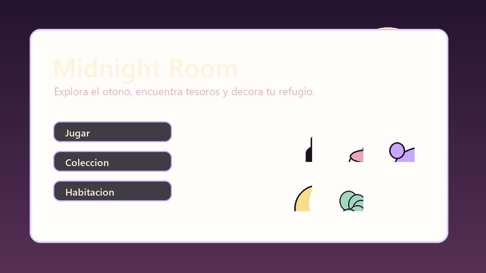
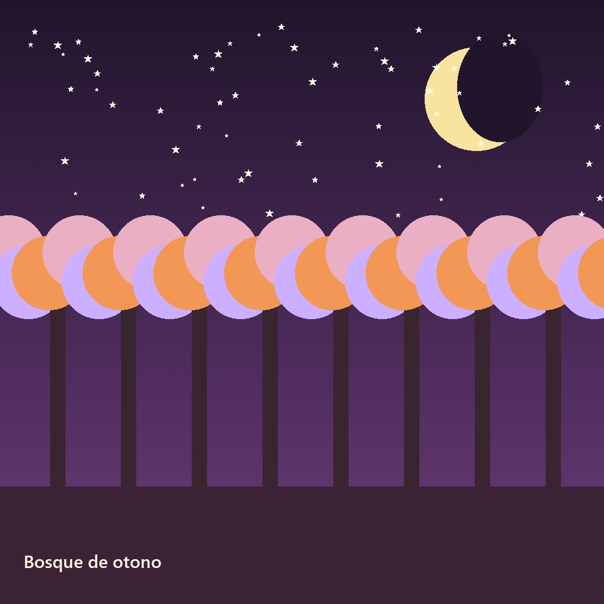
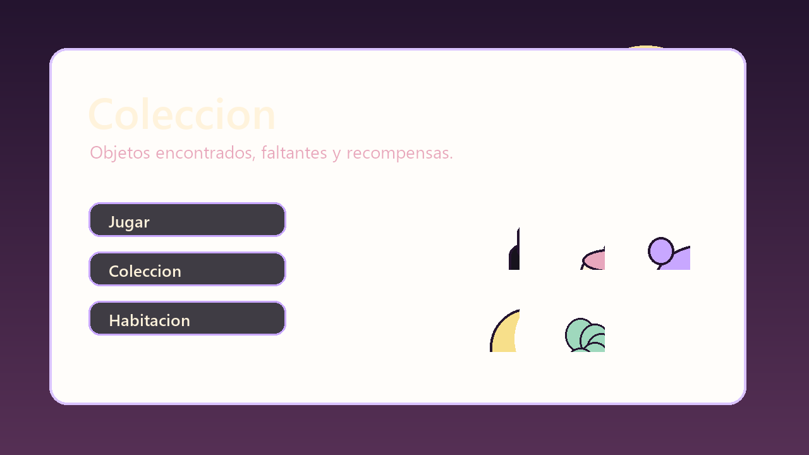
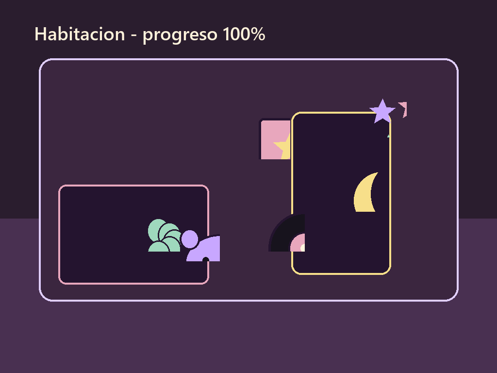

# Midnight Room

Videojuego indie 2D desarrollado en Unity. La base jugable conserva movimiento lateral, salto, doble salto, obstaculos, coleccionables, contador de tiempo, contador de intentos y finalizacion por nivel. La identidad visual fue renovada como una experiencia cozy, spooky cute y pastel goth sobre exploracion, coleccionismo y decoracion de una habitacion.

## Capturas y mockups visuales

Las siguientes imagenes muestran la nueva direccion visual aplicada al proyecto y a sus assets de portafolio.

| Menu principal | Bosque de otono |
| --- | --- |
|  |  |

| Coleccion | Habitacion completada |
| --- | --- |
|  |  |

## Descripcion

Midnight Room es una propuesta de plataformas 2D donde Mara Noctua explora escenarios de otono para encontrar objetos especiales con los que decorar su habitacion. La experiencia combina desplazamiento lateral, saltos, zonas de doble salto, enemigos, plataformas y una interfaz que registra el rendimiento durante la partida.

El juego incluye menu principal, panel de equipo, menu de pausa y pantalla final de nivel con resumen de intentos, hallazgos y tiempo.

## Caracteristicas principales

- Movimiento horizontal y salto mediante fisicas 2D.
- Sistema de doble salto en zonas especificas.
- Recoleccion de objetos decorativos.
- Enemigos y zonas de muerte con reinicio del jugador.
- Contador de tiempo por intento y tiempo acumulado.
- Contador de intentos.
- Pantalla de finalizacion de nivel redisenada como actualizacion de habitacion.
- Menu principal, equipo y menu de pausa.
- Cinco escenas de nivel incluidas en la configuracion de build.
- Paquete visual Midnight Room con personaje, fondos, tilesets, UI, coleccionables y progresion de habitacion.

## Controles

- **Mover al jugador:** flechas izquierda/derecha o eje horizontal configurado en Unity.
- **Saltar:** barra espaciadora o boton `Jump`.
- **Descender con impulso en el aire:** flecha abajo o eje vertical negativo.
- **Pausar / reanudar:** `Esc` o boton `Cancel`.

## Escenas incluidas

- `MenuPrincipal`
- `nivel1`
- `nivel2`
- `nivel3`
- `nivel4`
- `nivel5`

## Requisitos del proyecto

- Unity `2021.3.11f1`
- TextMeshPro `3.0.6`
- Cinemachine `2.8.9`
- Soporte 2D de Unity

## Como ejecutar desde Unity

1. Clonar o descargar este repositorio.
2. Abrir la carpeta del proyecto desde Unity Hub.
3. Usar Unity `2021.3.11f1` o una version compatible de Unity 2021 LTS.
4. Abrir la escena `Assets/Scenes/MenuPrincipal.unity`.
5. Presionar `Play` en el editor.

## Build e instalador para Windows

Este repositorio incluye archivos preparados para generar una version instalable para Windows:

- `Assets/Editor/BuildWindows.cs`: compila el juego para Windows desde Unity en modo batch.
- `tools/BuildWindows.ps1`: ejecuta Unity, genera el build y, si Inno Setup esta instalado, crea el instalador.
- `installer/Minijuego.iss`: configuracion del instalador para Inno Setup.

Para generar el build y el instalador:

```powershell
powershell -ExecutionPolicy Bypass -File tools/BuildWindows.ps1
```

El instalador final se genera en:

```text
dist/installer/Minijuego-Setup-1.0.exe
```

Nota: para crear el instalador es necesario tener Unity instalado con soporte Windows y tener Inno Setup disponible en el equipo. Si Unity o Inno Setup no estan instalados, el script mostrara el paso que falta.

## Estructura del proyecto

```text
Assets/
  Editor/          Script de build para Windows
  Images/          Sprites, fondos e iconos del videojuego
  Prefabs/         Jugador, plataformas, enemigos, UI y elementos de nivel
  Scenes/          Menu principal y niveles jugables
  Scripts/         Logica de movimiento, menus, contadores y eventos
Packages/          Dependencias del proyecto Unity
ProjectSettings/   Configuracion general del proyecto
docs/screenshots/  Capturas usadas en este README
docs/MIDNIGHT_ROOM_ART_BIBLE.md  Guia de arte y mapa de assets
installer/         Script para generar el instalador de Windows
tools/             Automatizacion de build
```

## Direccion de arte

La guia completa de estilo, mapeo de assets y notas de produccion esta en:

```text
docs/MIDNIGHT_ROOM_ART_BIBLE.md
```

Los assets nuevos estan en:

```text
Assets/Images/MidnightRoom/
```

Los sprites principales existentes tambien fueron reemplazados directamente para preservar referencias de Unity y evitar cambios de mecanicas.

## Creditos

- Estructura base: Charlotte y Gabriel Barrientos.
- Direccion visual y tematica Midnight Room: Charlotte Rodriguez.
- [Gabriel Barrientos](https://github.com/pinguin-frosch)
- [Charlotte Rodriguez](https://github.com/Thekawaiicokie)

## Contexto academico

Proyecto creado para el Taller de Desarrollo de Videojuegos.
